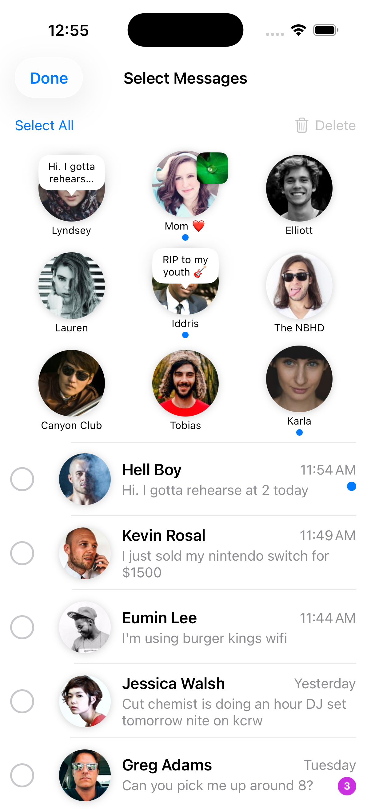
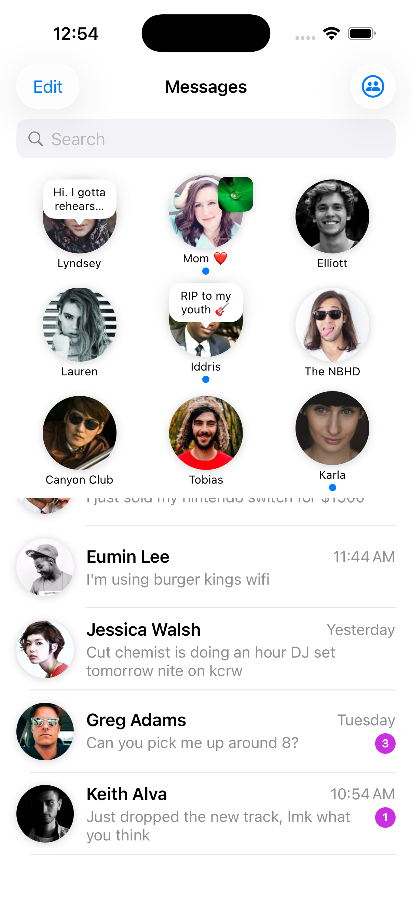
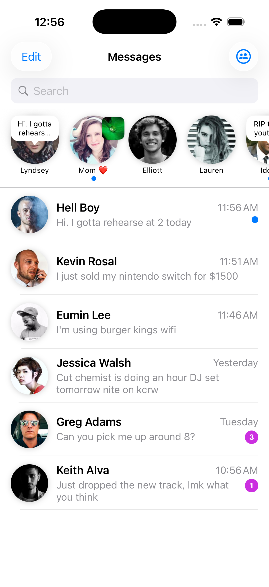
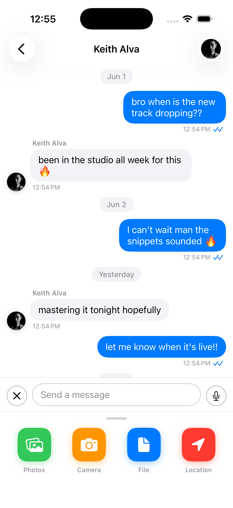
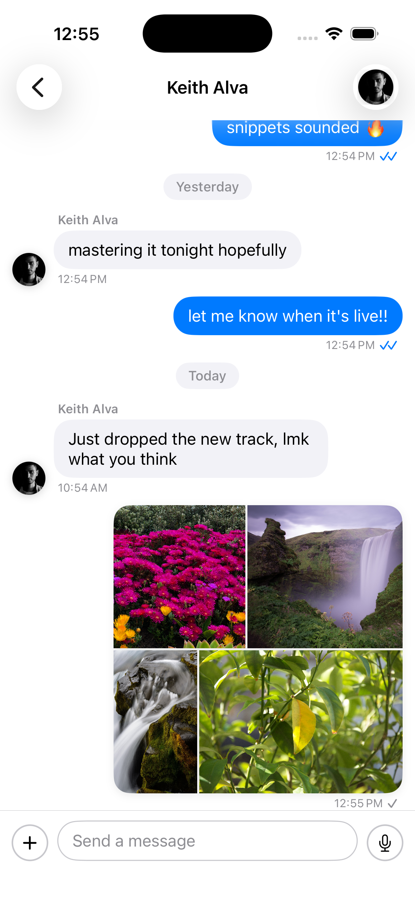
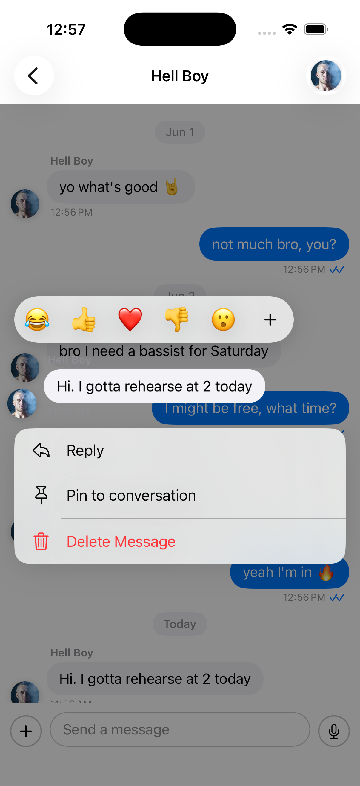

# BubbleKit

A plug-and-play SwiftUI conversation list **and** chat UI kit — pixel-matched to the iOS Messages design. Drop it into any app via Swift Package Manager and get a fully functional chat list with pinned contacts, search, filters, swipe actions, deep customisation hooks, and a complete per-conversation chat screen with attachments, reactions, replies, voice notes, and more.

---

## Table of Contents

- [Requirements](#requirements)
- [Installation](#installation)
- [Quick Start](#quick-start)
- [Conversation List Features](#conversation-list-features)
  - [Search](#search)
  - [Filter Tabs](#filter-tabs)
  - [Swipe Actions](#swipe-actions)
  - [Long-Press Context Menu](#long-press-context-menu)
  - [Edit Menu](#edit-menu)
  - [Select Messages Mode](#select-messages-mode)
- [Pinned Contacts](#pinned-contacts)
  - [Display Modes](#display-modes)
  - [Pin Status Content](#pin-status-content)
  - [Edit Pins Mode](#edit-pins-mode)
- [Chat Screen](#chat-screen)
  - [Basic Setup](#basic-setup)
  - [Loading & Appending Messages](#loading--appending-messages)
  - [Attachments](#attachments)
  - [Reactions](#reactions)
  - [Reply to a Message](#reply-to-a-message)
  - [Edit a Message](#edit-a-message)
  - [Delete a Message](#delete-a-message)
  - [Pin Messages](#pin-messages)
  - [Voice Notes](#voice-notes)
  - [Fullscreen Image Gallery](#fullscreen-image-gallery)
  - [Reply Navigation & Highlight](#reply-navigation--highlight)
  - [Chat Event Delegate](#chat-event-delegate)
  - [Compose Screen](#compose-screen)
- [Theming](#theming)
  - [Built-in Themes](#built-in-themes)
  - [Custom Theme](#custom-theme)
- [Delegate System](#delegate-system)
  - [BKDataSource](#bkdatasource)
  - [BKEventDelegate](#bkeventdelegate)
  - [BKUIDelegate](#bkuidelegate)
- [Models Reference](#models-reference)
- [Sample Data](#sample-data)

---

## Requirements

- iOS 16.0+
- Swift 5.9+
- Xcode 15+

---

## Installation

### Swift Package Manager

1. In Xcode open **File → Add Package Dependencies**
2. Enter the repository URL:
   ```
   https://github.com/akshaydevine/BubbleKit/
   ```
3. Select **Up to Next Major Version** starting from `1.0.0`
4. Click **Add Package**

### Package.swift

```swift
dependencies: [
    .package(url: "https://github.com/your-org/BubbleKit", from: "1.0.0")
],
targets: [
    .target(
        name: "YourApp",
        dependencies: ["BubbleKit"]
    )
]
```

---

## Quick Start

The fastest way to get a working conversation list — one line:

```swift
import BubbleKit

struct ContentView: View {
    var body: some View {
        BubbleKit.preview          // horizontal scroll pins, sample data
        // BubbleKit.previewGrid   // grid layout pins, sample data
    }
}
```

### Production usage with your own delegate:

```swift
struct ContentView: View {
    @StateObject private var holder = DelegateHolder()

    var body: some View {
        BubbleKit.makeConversationList(
            title:             "Messages",
            theme:             .default,
            pinnedDisplayMode: .grid,
            delegate:          holder.delegate
        )
    }
}
```

`DelegateHolder` wraps your delegate as an `@StateObject` so it lives for the lifetime of the view:

```swift
final class DelegateHolder: ObservableObject {
    let delegate = MyAppDelegate()
}

final class MyAppDelegate: BKFullDelegate {
    // implement BKDataSource + BKEventDelegate + BKUIDelegate
}
```

---

## Conversation List Features

### Search

Built-in search bar appears above the list. Activates on focus and shows a **Cancel** button.

- Default: filters `displayName` and `lastMessage` locally
- Custom: implement `BKDataSource.conversations(matching:)` to run your own search (API, Core Data, etc.)

```swift
func conversations(matching query: String) -> [BKConversation]? {
    // return nil to use built-in local filter
    return myDatabase.search(query)
}
```

### Filter Tabs

Three built-in filter tabs — **All**, **Unread**, **Groups**. Switching fires `BKEventDelegate.bubbleKit(didChangeFilter:)`.

```swift
func bubbleKit(didChangeFilter filter: BKConversationFilter) {
    switch filter {
    case .all:    loadAll()
    case .unread: loadUnread()
    case .groups: loadGroups()
    }
}
```

### Swipe Actions

| Direction | Actions |
|-----------|---------|
| Trailing (left swipe) | **Delete** (red, full-swipe) · **Archive** (grey) |
| Leading (right swipe) | **Pin / Unpin** (blue, full-swipe) |

Swipe actions are automatically hidden when **Select Messages** mode is active.

Handle events via the event delegate:

```swift
func bubbleKit(didHandle event: BKConversationEvent) {
    switch event.kind {
    case .swipeDelete:  removeLocally(event.conversation)
    case .swipeArchive: archive(event.conversation)
    case .swipePin:     togglePin(event.conversation)
    default: break
    }
}
```

### Long-Press Context Menu

Long-pressing any row shows a popover with:
- **Pin / Unpin** — toggles pinned state
- **Delete** — removes from list with animation

Override the entire popover with your own view:

```swift
func bubbleKit(popoverViewFor conversation: BKConversation,
               actions: [BKContextAction]) -> AnyView? {
    AnyView(MyCustomPopover(conversation: conversation, actions: actions))
}
```

### Edit Menu

The **Edit** button in the navigation bar reveals a dropdown with two default actions:

| Action | ID constant |
|--------|-------------|
| Select Messages | `BKEditAction.selectMessagesID` |
| Edit Pins | `BKEditAction.editPinsID` |

Provide your own actions by implementing:

```swift
func editMenuActions() -> [BKEditAction]? {
    [
        BKEditAction(id: BKEditAction.selectMessagesID,
                     title: "Select Messages", icon: "checkmark.circle"),
        BKEditAction(id: BKEditAction.editPinsID,
                     title: "Edit Pins", icon: "pin"),
        BKEditAction(title: "Mark All Read", icon: "envelope.open"),
        BKEditAction(title: "Clear All",     icon: "trash", role: .destructive),
    ]
}
```

Return `nil` to use the SDK defaults. Handle selection:

```swift
func bubbleKit(didSelectEditAction action: BKEditAction) {
    switch action.id {
    case BKEditAction.selectMessagesID: enterMultiSelectMode()
    case BKEditAction.editPinsID:       showPinEditor()
    default: print("Custom action: \(action.title)")
    }
}
```

### Select Messages Mode

Activated from the Edit → Select Messages menu item. In this mode a **checkmark circle** slides in from the left of each row, tapping toggles selection, and a bottom toolbar provides **Select All** and **Delete** actions.

<p align="center">
  
</p>

| Button | Behaviour |
|--------|-----------|
| **Select All** | Selects every conversation; label changes to **Deselect All** |
| **Delete** | Deletes all selected conversations; disabled when nothing selected |

- A **Done** button in the navigation bar exits the mode
- The list automatically insets its bottom so the last row is never hidden behind the toolbar

---

## Pinned Contacts

### Display Modes

BubbleKit supports two pinned contact layouts. Pass `pinnedDisplayMode` to `makeConversationList`:

```swift
// Horizontal scroll strip (default — original iOS Messages style)
BubbleKit.makeConversationList(pinnedDisplayMode: .horizontalScroll, delegate: delegate)

// 3-column grid (pages when > 9 pins)
BubbleKit.makeConversationList(pinnedDisplayMode: .grid, delegate: delegate)
```

| Mode | Max visible | Overflow behaviour |
|------|-------------|-------------------|
| `.horizontalScroll` | Unlimited | Scrolls horizontally |
| `.grid` | 9 per page | Paginates horizontally |

<p align="center">
  
  &nbsp;&nbsp;&nbsp;
  
</p>
<p align="center"><em>Left: Grid mode &nbsp;·&nbsp; Right: Horizontal scroll mode</em></p>

### Pin Status Content

Each pinned entry can show a status above its avatar. Three types are supported:

```swift
// Text bubble with tail pointing down
BKPinnedEntry(contact: contact, status: .text("Hi! Running 5 mins late 🏃"))

// Image thumbnail in the top-right corner of the avatar
BKPinnedEntry(contact: contact, status: .image(URL(string: "https://...")!))

// Both text bubble AND image thumbnail shown simultaneously
BKPinnedEntry(contact: contact, status: .both("Just landed! 🛫", URL(string: "https://...")!))

// No status
BKPinnedEntry(contact: contact, status: nil)
```

`BKStatusContent` convenience accessors — useful when rendering custom cells:

```swift
entry.status?.text      // String? — present for .text and .both
entry.status?.imageURL  // URL?    — present for .image and .both
```

### Edit Pins Mode

Activated from Edit → Edit Pins. In this mode each pinned cell shows a **minus (−)** remove button. Status overlays and blue unread dots are hidden while editing. Tap **Done** to exit.

Handle removal:

```swift
func bubbleKit(didHandle event: BKPinnedEvent) {
    switch event.kind {
    case .remove:               pins.removeAll { $0.id == event.entry.id }
    case .add:                  pins.append(event.entry)
    case .reorder(let f, let t): pins.move(fromOffsets: [f], toOffset: t)
    default: break
    }
}
```

---

## Chat Screen

`BKChatView` is a full-featured per-conversation chat screen. It is driven entirely by `BKChatViewModel` — create one per conversation and pass it in.

### Basic Setup

```swift
import BubbleKit

// 1. Create the view model
let chatVM = BKChatViewModel(
    chatInfo: BKChatInfo(
        title:    "Leia Organa",
        subtitle: "Active now",
        avatar:   .url(URL(string: "https://...")!),
        isGroup:  false
    ),
    currentUser: BKContact(
        id:     "me",
        name:   "You",
        avatar: .initials("ME", .white, Color(hex: "#007AFF"))
    ),
    messages: []   // pass initial messages from your API/DB here
)

// 2. Present the view inside a NavigationStack
NavigationStack {
    BKChatView(viewModel: chatVM)
}
```

> **Important:** `currentUser` is the logged-in user. Every message the user sends is stamped with this contact as the sender and rendered as an outgoing (right-aligned, blue) bubble.

### Loading & Appending Messages

```swift
// Replace all messages at once (e.g. after an API fetch)
chatVM.load(messages: myMessages)

// Append a single incoming message in real-time (e.g. from a WebSocket)
let incoming = BKMessage(
    sender:      otherContact,
    text:        "Hey, what's up?",
    sentAt:      Date(),
    isOutgoing:  false,
    readReceipt: .delivered
)
chatVM.appendMessage(incoming)
```

`load()` replaces all messages and scrolls to the bottom. `appendMessage()` adds one message, scrolls to it, and fires `BKChatEventDelegate.bkChat(didSend:)`.

### Attachments

`BKMessage` supports five attachment types. Pass them in the `attachments` array:

```swift
// Image
BKMessage(sender: me, attachments: [.image(imageURL)], isOutgoing: true)

// Document (PDF, zip, docx, etc.)
BKMessage(sender: me, attachments: [.document(fileURL, filename: "report.pdf")], isOutgoing: true)

// Voice note
BKMessage(sender: me, attachments: [.audio(audioURL, duration: 12)], isOutgoing: true)

// Location — opens Apple Maps on tap
BKMessage(
    sender:      me,
    attachments: [.location(mapsURL, latitude: 37.78, longitude: -122.41, address: "San Francisco, CA")],
    isOutgoing:  true
)
```

Multiple attachments on one message are displayed in an auto-layout grid (1 image → full width, 2 → side by side, 3+ → mosaic).

The **`+` button** in the input bar opens a Telegram-style attachment panel with four built-in pickers:

| Icon | Label | System picker used |
|------|-------|--------------------|
| 🟢 Photos | Photo library | `PhotosPickerItem` |
| 🟠 Camera | Camera roll | `UIImagePickerController` |
| 🔵 File | Document picker | `UIDocumentPickerViewController` |
| 🔴 Location | Current GPS location | `CLLocationManager` |

<p align="center">
  
  &nbsp;&nbsp;&nbsp;
  
</p>
<p align="center"><em>Left: Attachment picker panel &nbsp;·&nbsp; Right: Multi-image mosaic layout</em></p>

### Reactions

Long-pressing any bubble opens a context overlay with a quick-emoji bar (`😂 👍 ❤️ 👎 😮 +`). Tapping an emoji toggles your reaction on the message.

The **`+`** button opens a full emoji picker sheet with 700+ emoji across 7 categories and a live search bar.

```swift
// React programmatically
chatVM.react(emoji: "👍", to: message)
```

Reactions are displayed above the bubble. Tapping your own reaction removes it; tapping an existing reaction from someone else increments its count.

### Reply to a Message

Long-press a bubble → tap **Reply**. A reply banner appears above the input bar showing the quoted sender and preview text. The sent message stores a `BKMessageReply` reference.

Tapping the **reply quote** inside any bubble scrolls directly to the original message and flashes a yellow highlight.

```swift
// Reply programmatically
chatVM.reply(to: message)

// Cancel a pending reply
chatVM.cancelReply()
```

### Edit a Message

Long-press an outgoing bubble → tap **Edit Message**. The input bar pre-fills with the current text and shows a green confirm button. Submitting updates the bubble in place.

```swift
// Start editing programmatically
chatVM.startEdit(message: message)

// Commit the edit
chatVM.commitEdit()

// Cancel without saving
chatVM.cancelEdit()
```

### Delete a Message

Long-press any bubble → tap **Delete Message**. The bubble is replaced with a *"Message deleted"* placeholder — the message is never removed from the list so reply quotes and thread counts remain consistent.

```swift
chatVM.deleteMessage(message)
```

The long-press context menu also surfaces **Reply**, **Pin to conversation**, and **Delete Message** actions alongside the emoji reaction bar.

<p align="center">
  
</p>

### Pin Messages

Long-press any bubble → tap **Pin to conversation**. A pinned message bar appears at the top of the chat. Tapping the bar scrolls to and highlights that message. Tap the × on the bar or long-press again and choose **Unpin** to dismiss.

```swift
chatVM.togglePin(message: message)
chatVM.dismissPinnedBar()
```

### Voice Notes

Tap the **microphone** button in the input bar (visible when the text field is empty) to start recording. The input bar transforms into a Telegram-style recording bar with:

- Animated waveform
- Live timer
- **Trash** button to cancel
- **Lock** indicator (slide up to lock recording hands-free)
- **Send** button to send the voice note immediately

Sent voice notes render as a playable audio bubble with a play/pause button and a progress slider.

### Fullscreen Image Gallery

Tapping any image bubble opens a fullscreen swipeable gallery with:

- Pinch-to-zoom and double-tap-to-zoom per image
- Page indicator when multiple images are present
- Share button (top-right)
- Close button

```swift
// Open programmatically
chatVM.openImage(url)
chatVM.openImages([url1, url2, url3], startIndex: 1)
```

### Reply Navigation & Highlight

Tapping the reply quote strip inside any bubble navigates back to the original message, scrolls it into view, and flashes a yellow highlight for ~1.4 seconds — identical to WhatsApp behaviour.

This works correctly even when:
- The same reply is tapped twice in a row (state is always reset before each navigation)
- The original message is far up the scroll view (highlight waits 0.55 s for scroll to finish)
- Multiple reply banners are tapped quickly (a token system cancels stale highlight timers)

```swift
// Trigger programmatically (e.g. from a search result)
chatVM.scrollToAndHighlight(messageID: "msg-id-123")
```

### Chat Event Delegate

Conform to `BKChatEventDelegate` to receive chat-level events:

```swift
final class MyChatDelegate: BKChatEventDelegate {

    func bkChat(didSend message: BKMessage) {
        // Upload to your backend / WebSocket
        api.send(message)
    }

    func bkChat(didTapAttachment attachment: BKAttachment, in message: BKMessage) {
        // Handle document open, location tap, etc.
        switch attachment {
        case .document(let url, let filename): openDocument(url, name: filename)
        case .location(let url, _, _, _):      UIApplication.shared.open(url)
        default: break
        }
    }

    func bkChat(didLongPress message: BKMessage) {
        // Called when long-press context menu is triggered
        analytics.track("message_long_press")
    }
}

// Attach to the view model
chatVM.eventDelegate = myChatDelegate
```

All three methods have default no-op implementations so you only implement what you need.

### Compose Screen

The **New Message** compose screen lets users pick recipients before starting a conversation.

```swift
BKComposeView(
    contacts: myContacts   // [BKContact] to search from
) { recipients, firstMessage in
    // recipients: [BKContact] — who the user selected
    // firstMessage: String?   — optional text typed before tapping Send
    let conversation = createConversation(with: recipients)
    navigate(to: BKChatView(viewModel: chatVM(for: conversation)))
} onCancel: {
    dismiss()
}
```

Or via the `BubbleKit` namespace:

```swift
BubbleKit.makeComposeView(contacts: myContacts) { recipients, firstMessage in
    // handle send
}
```

Features:
- Recipient chips with `×` remove button
- Live contact search as you type
- `+` button to open a full contact picker sheet
- Input bar with Send button (disabled until at least one recipient is chosen)

---

## Theming

### Built-in Themes

```swift
BubbleKit.makeConversationList(theme: .default, delegate: delegate)  // light
BubbleKit.makeConversationList(theme: .dark,    delegate: delegate)  // dark
```

The same theme flows automatically into `BKChatView` when opened from the conversation list. To apply a theme directly to a standalone chat screen:

```swift
BKChatView(viewModel: chatVM)
    .bubbleKitTheme(.dark)
```

### Custom Theme

All theme tokens are public structs — override only what you need:

```swift
var myColors = BubbleKitColors.default
myColors.notifyPurple     = Color(hex: "#FF2D55")   // red badge
myColors.appleBlue        = Color(hex: "#34C759")   // green accent
myColors.pinnedBackground = Color(hex: "#F9F9F9")

var myLayout = BubbleKitLayout.default
myLayout.avatarDiameter       = 52
myLayout.pinnedAvatarDiameter = 68
myLayout.rowHeight            = 76

var myTypography = BubbleKitTypography.default
myTypography.senderName = .system(size: 16, weight: .bold)

let myTheme = BubbleKitTheme(
    colors:     myColors,
    typography: myTypography,
    effects:    .default,
    layout:     myLayout
)

BubbleKit.makeConversationList(theme: myTheme, delegate: delegate)
```

#### Color tokens

| Token | Default (light) | Default (dark) | Usage |
|-------|----------------|----------------|-------|
| `appleBlack` | `#000000` | `#FFFFFF` | Names, primary text |
| `appleGrey` | `#8E8E93` | `#8E8E93` | Timestamps, previews |
| `appleBlue` | `#007AFF` | `#0A84FF` | Links, accents, outgoing bubble |
| `notifyPurple` | `#AF52DE` | `#BF5AF2` | Unread badge |
| `messageSentNew` | `#007AFF` | `#0A84FF` | Unread dot |
| `background` | `#FFFFFF` | `#000000` | Screen background |
| `rowBackground` | `#FFFFFF` | `#1C1C1E` | List row background |
| `pinnedBackground` | `#FFFFFF` | `#000000` | Pinned strip background |
| `popoverBackground` | `#FFFFFF` | `#2C2C2E` | Context menu background |
| `searchBackground` | `#F2F2F7` | `#1C1C1E` | Search bar fill |

#### Layout tokens

| Token | Default | Usage |
|-------|---------|-------|
| `avatarDiameter` | `56` | Conversation list avatar size |
| `pinnedAvatarDiameter` | `72` | Pinned strip avatar size |
| `rowHeight` | `80` | Minimum list row height |
| `horizontalPadding` | `16` | Left/right padding for rows and search |
| `storyRingWidth` | `3` | Story ring stroke width |
| `badgeHeight` | `20` | Unread badge height |
| `cornerRadius` | `10` | Popover corner radius |

---

## Delegate System

All three protocols are combined into `BKFullDelegate` for convenience. You can also wire them separately.

```swift
// All-in-one (recommended)
final class MyDelegate: BKFullDelegate { ... }

// Separate (advanced)
BKConversationListView(
    dataSource:    myDataSource,
    eventDelegate: myEventDelegate,
    uiDelegate:    myUIDelegate
)
```

### BKDataSource

Provides data to the SDK.

```swift
public protocol BKDataSource: AnyObject {
    // Required
    func conversations(for filter: BKConversationFilter) -> [BKConversation]

    // Optional — return nil to use SDK defaults
    func conversations(matching query: String) -> [BKConversation]?
    func pinnedEntries() -> [BKPinnedEntry]?
    func contextActions(for conversation: BKConversation) -> [BKContextAction]
    func editMenuActions() -> [BKEditAction]?
}
```

### BKEventDelegate

Receives user interaction events.

```swift
public protocol BKEventDelegate: AnyObject {
    func bubbleKit(didHandle event: BKConversationEvent)   // tap, swipe, long-press
    func bubbleKit(didHandle event: BKPinnedEvent)         // pin tap, add, remove, reorder
    func bubbleKit(didChangeSearchQuery query: String)
    func bubbleKit(didBeginSearch: Bool)
    func bubbleKit(didCancelSearch: Bool)
    func bubbleKit(destinationFor conversation: BKConversation) -> AnyView?
    func bubbleKitDidTapCompose()
    func bubbleKit(didChangeFilter filter: BKConversationFilter)
    func bubbleKitDidTapEdit(isOpen: Bool)
    func bubbleKit(didSelectEditAction action: BKEditAction)
}
```

Provide a navigation destination for conversation tap:

```swift
func bubbleKit(destinationFor conversation: BKConversation) -> AnyView? {
    let chatVM = BKChatViewModel(
        chatInfo:    BKChatInfo(title: conversation.displayName,
                                avatar: conversation.participants.first?.avatar ?? .placeholder),
        currentUser: myLoggedInUser,
        messages:    myMessages(for: conversation.id)
    )
    return AnyView(BKChatView(viewModel: chatVM))
}
```

### BKUIDelegate

Swap out any visual component with your own.

```swift
public protocol BKUIDelegate: AnyObject {
    func bubbleKit(rowViewFor conversation: BKConversation) -> AnyView?
    func bubbleKit(avatarViewFor contact: BKContact, size: CGFloat) -> AnyView?
    func bubbleKit(badgeViewFor unreadCount: Int) -> AnyView?
    func bubbleKitPinnedRowView(entries: [BKPinnedEntry]) -> AnyView?
    func bubbleKit(pinnedCellViewFor entry: BKPinnedEntry) -> AnyView?
    func bubbleKit(popoverViewFor conversation: BKConversation,
                   actions: [BKContextAction]) -> AnyView?
    func bubbleKitEmptyStateView(for filter: BKConversationFilter) -> AnyView?
    func bubbleKitEmptySearchView(query: String) -> AnyView?
    func bubbleKitLeadingBarItems() -> AnyView?
    func bubbleKitTrailingBarItems() -> AnyView?
    func bubbleKitSearchBarView(query: Binding<String>) -> AnyView?
}
```

Return `nil` from any method to use the SDK default. Example — custom badge:

```swift
func bubbleKit(badgeViewFor unreadCount: Int) -> AnyView? {
    AnyView(
        Text("\(unreadCount)")
            .font(.system(size: 11, weight: .bold))
            .foregroundColor(.white)
            .padding(6)
            .background(Color.red)
            .clipShape(Circle())
    )
}
```

---

## Models Reference

### BKConversation

```swift
BKConversation(
    id:                 "c1",
    participants:       [contact],
    displayName:        "Alice",         // inferred from participants if nil
    lastMessage:        "See you soon!",
    lastMessageTime:    Date(),
    isRead:             false,
    unreadCount:        3,
    isPinned:           false,
    isMuted:            false,
    hasTypingIndicator: false
)
```

### BKContact

```swift
BKContact(
    id:       "alice",
    name:     "Alice",
    avatar:   .url(URL(string: "https://...")!),
    isOnline: true
)
```

Avatar types: `.url(URL)` · `.image(String)` · `.systemSymbol(String)` · `.initials(String, Color, Color)` · `.placeholder`

### BKMessage

```swift
BKMessage(
    id:           UUID().uuidString,   // auto-generated if omitted
    sender:       contact,
    text:         "Hello!",
    attachments:  [],                  // [BKAttachment]
    sentAt:       Date(),
    isOutgoing:   true,
    readReceipt:  .sent,               // .sent · .delivered · .read
    replyTo:      nil,                 // BKMessageReply?
    isTranslated: false,
    reactions:    [],                  // [BKReaction]
    isDeleted:    false,
    isPinned:     false
)
```

### BKAttachment

```swift
.image(URL)
.document(URL, filename: String)
.audio(URL, duration: Int)            // duration in seconds
.location(URL, latitude: Double, longitude: Double, address: String?)
```

### BKReaction

```swift
BKReaction(
    emoji: "👍",
    count: 3,
    byMe:  true    // true = current user reacted; tap again to un-react
)
```

### BKReadReceipt

| Case | Display |
|------|---------|
| `.sent` | Single grey tick |
| `.delivered` | Double grey tick |
| `.read` | Double blue tick |

### BKChatInfo

```swift
BKChatInfo(
    title:    "Design Team",
    subtitle: "12 members",    // shown below title in nav bar
    avatar:   .url(groupImageURL),
    isGroup:  true
)
```

### BKPinnedEntry

```swift
BKPinnedEntry(
    contact:      contact,
    conversation: conversation,  // optional link back
    hasUnread:    true,
    unreadCount:  2,
    status:       .both("On my way! 🚗", imageURL)
)
```

### BKStatusContent

```swift
.text("Hello! 👋")                          // text bubble above avatar
.image(url)                                 // thumbnail top-right of avatar
.both("Caption", url)                       // text bubble + thumbnail together
```

---

## Sample Data

### Conversation list

`BKSampleData` uses a single `Record` table as the source of truth. All three derived arrays (`contacts`, `conversations`, `pinnedEntries`) are computed from it — edit in one place only.

```swift
func conversations(for filter: BKConversationFilter) -> [BKConversation] {
    BKSampleData.conversations
}

func pinnedEntries() -> [BKPinnedEntry]? {
    BKSampleData.pinnedEntries
}
```

To add a new person, append one `Record` to the master table:

```swift
// Pinned only (no conversation row)
Record(id: "sara", name: "Sara", avatarURL: "https://...", isOnline: true,
       isPinnedEntry: true, pinnedStatus: .text("Coffee? ☕️"))

// Conversation only (no pinned strip entry)
Record(id: "mike", name: "Mike", avatarURL: "https://...", isOnline: false,
       lastMessage: "See you at 6!", lastMessageTime: -1800, isRead: false)

// Both pinned and in conversation list
Record(id: "jen", name: "Jen", avatarURL: "https://...", isOnline: true,
       lastMessage: "Running late", lastMessageTime: -600,
       isPinnedEntry: true, pinnedStatus: .text("Running late"))
```

### Chat screen

`BKChatSampleData` provides ready-made participants and messages for previews:

```swift
// In your SwiftUI preview:
BKChatView(viewModel: BKChatViewModel(
    chatInfo:    BKChatSampleData.groupChatInfo,
    currentUser: BKChatSampleData.me,
    messages:    BKChatSampleData.messages
))
```

Available sample objects:

| Symbol | Type | Description |
|--------|------|-------------|
| `BKChatSampleData.me` | `BKContact` | The logged-in demo user |
| `BKChatSampleData.leia` | `BKContact` | A sample remote contact |
| `BKChatSampleData.groupChatInfo` | `BKChatInfo` | A sample group chat header |
| `BKChatSampleData.messages` | `[BKMessage]` | Three sample messages (image, text, reply) |

> ⚠️ `BKChatSampleData` is for **previews and demos only**. In production always pass real data via `BKChatViewModel(chatInfo:currentUser:messages:)`.

---

## License

MIT © 2026 BubbleKit
